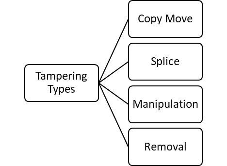
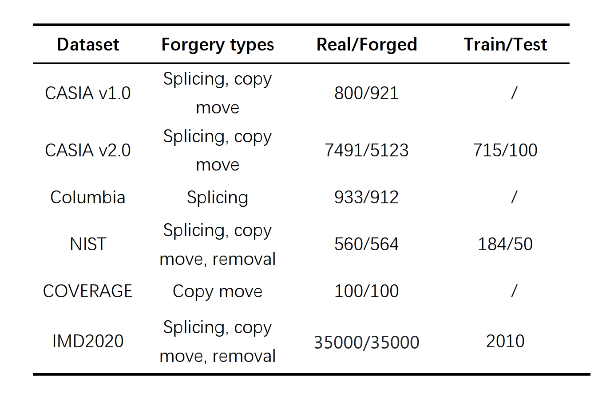

# 多模态大模型在图像伪造检测中的性能评估

[English Version](README_EN.md) ｜ [中文版](README_CN.md)

## 📋 项目概览

本项目旨在系统性分析和对比**传统篡改检测专有模型**与**多模态大模型**在图像伪造检测领域的性能差异。通过对多种篡改类型和数据集的全面评测，为图像内容安全领域的模型选择和优化提供科学依据。

## 🔬 项目信息
- **导师**：陈昌盛
- **实验室**：深圳市媒体信息内容安全重点实验室

## 🚀 项目特点
- **首次系统性评估**：首次全面分析多模态大模型在篡改图像检测领域的性能表现
- **多维度对比**：从多种篡改类型、不同数据集、多种评价指标进行全方位对比

## 📊 篡改类型与数据集

### 常见篡改类型
通过调研分析，我们识别出四种常见的图像篡改类型：
- **Copy Move**：复制图像中的部分内容并移动到其他位置
- **Splice**：将不同图像的部分内容拼接在一起
- **Manipulation**：对图像内容进行修改或编辑
- **Removal**：移除图像中的部分内容

### 实验数据集
我们在实验中使用了多个常见的图像篡改检测数据集：CASIA v1.0, CASIA v2.0, Columbia, NIST, COVERAGE, IMD2020

## 🤖 评估模型

### 传统篡改检测模型
我们对六个在MIML训练集上专门训练或微调的传统模型进行了评测：

| 模型名称 | 特点 |
|---------|------|
| CatNet | 基于深度学习的篡改检测模型 |
| OSN | 面向特定篡改类型优化的模型 |
| IML-VIT | 结合Vision Transformer的模型 |
| Profact | 专注于细粒度篡改检测的模型 |
| Focal | 基于焦点损失函数的模型 |
| PSCC-Net | 结合像素级和语义级特征的模型 |

传统篡改检测模型 (CatNet) 的模型架构：

这些专有模型以像素掩码形式输出篡改区域信息，使用Precision、Recall、F1、IoU等掩码级别指标进行评估。

### 多模态大模型
我们选取并评测了六个代表性的多模态大模型：

| 模型名称 | 特点 |
|---------|------|
| Florence-2-large | 通用视觉-语言模型 |
| SESAME | 专为安全场景优化的多模态模型 |
| LISA-13B | 大型多模态理解模型 |
| PixelLM_13B | 像素级理解的大型语言模型 |
| GLaMM | 通用多模态掩码模型 |
| LaSagnA | 面向安全应用的多模态模型 |

多模态大模型 (LISA) 的模型架构：

这些模型能够针对输入的图像以及文本描述，输出相应的篡改掩码（Mask）。我们使用掩码指标（如Precision、Recall、F1和IoU）对其在不同类型与来源的数据集上的检测能力进行对比分析。

## 📈 实验结果

### 示例图像
以下是部分模型在篡改检测任务上的示例结果：

- 传统篡改检测模型检测出的篡改区域示例

- 多模态大模型检测出的篡改区域示例

### IOU指标对比
通过雷达图直观展示不同模型在IOU指标上的表现对比：

- 传统篡改检测模型在不同篡改类型上的IOU指标雷达图

- 多模态大模型在不同篡改类型上的IOU指标雷达图
 

## 📝 结论

### 传统篡改检测模型表现
相较于通用多模态大模型，这些专有模型针对特定数据与任务进行了定制化训练，因此在特定类型的篡改检测上有一定优势。

### 多模态大模型表现
多模态大模型在不同类型篡改任务上的表现存在较大差异。整体而言，一些模型在特定类型的篡改检测上表现较为突出（如在splice任务中），但仍缺乏对所有类型篡改的普适高精度表现。

### 总体评价
目前的已有模型在篡改检测的广度与深度上都有不足：通用大模型适应性强但精度有待提升，专有模型在特定场景下更优秀但泛化能力不强。

## 🔍 未来展望
基于本项目的评测结果，未来研究可重点关注以下方向：
1. 针对多模态大模型在特定篡改类型上的不足进行针对性微调
2. 开发更全面的篡改检测基准数据集和评价指标