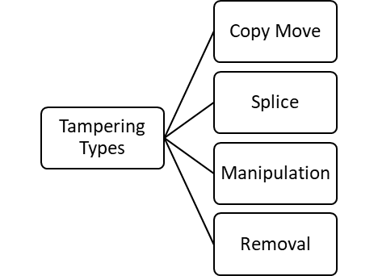
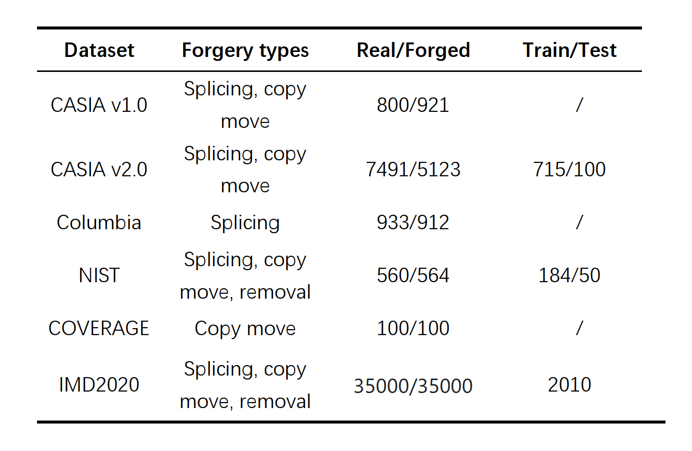
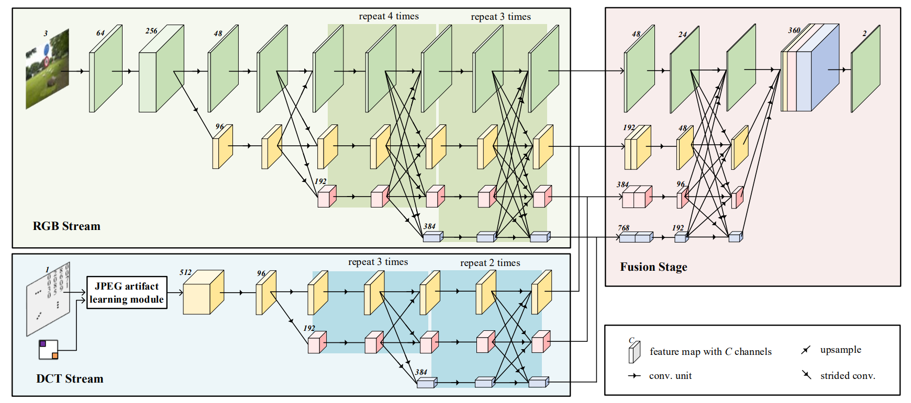
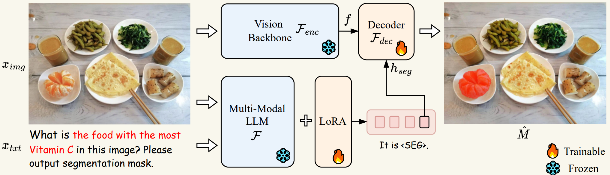
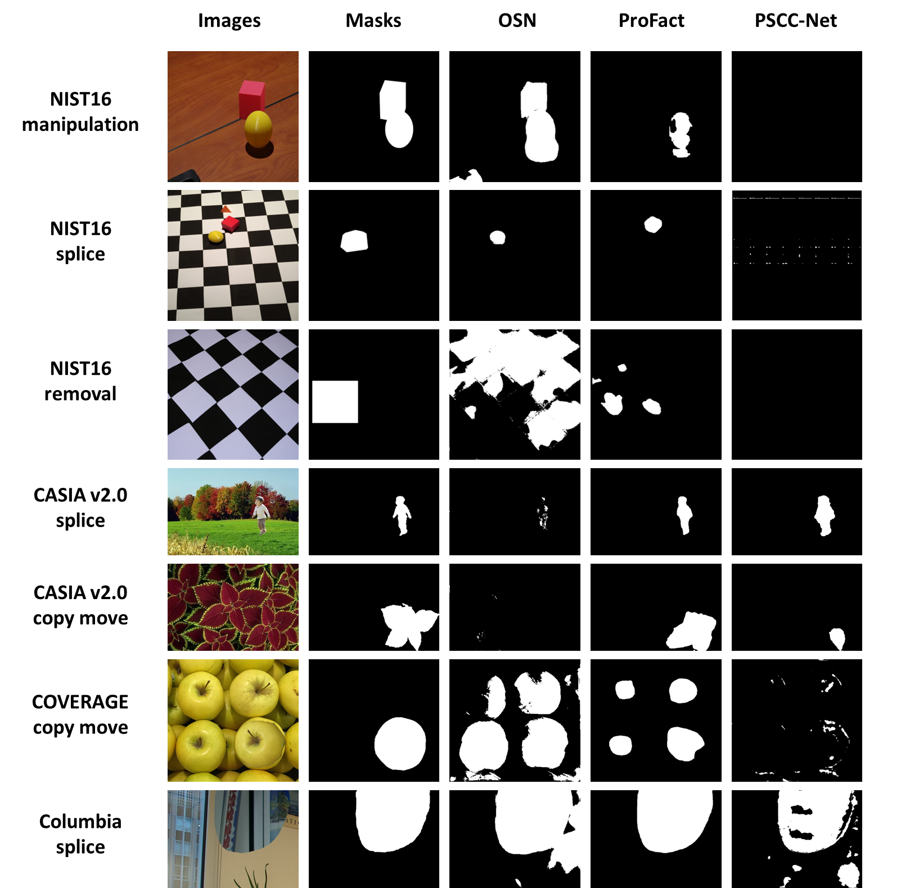
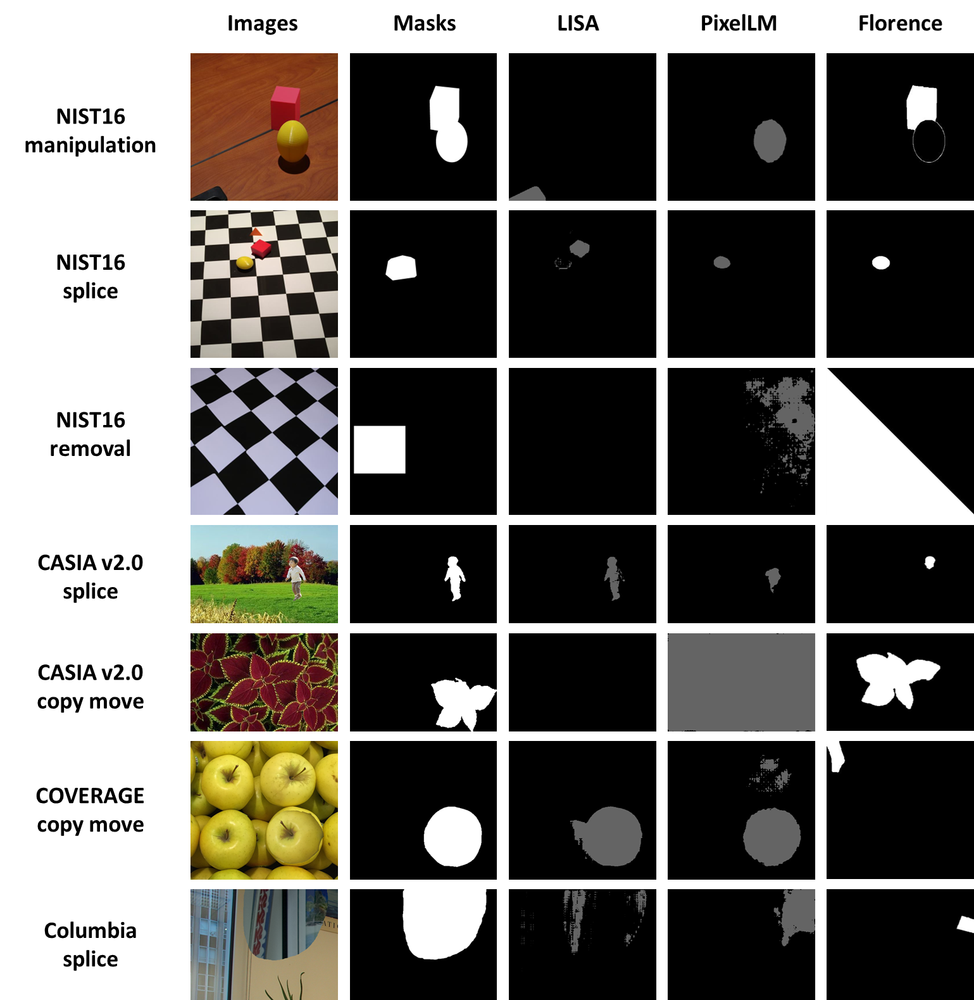
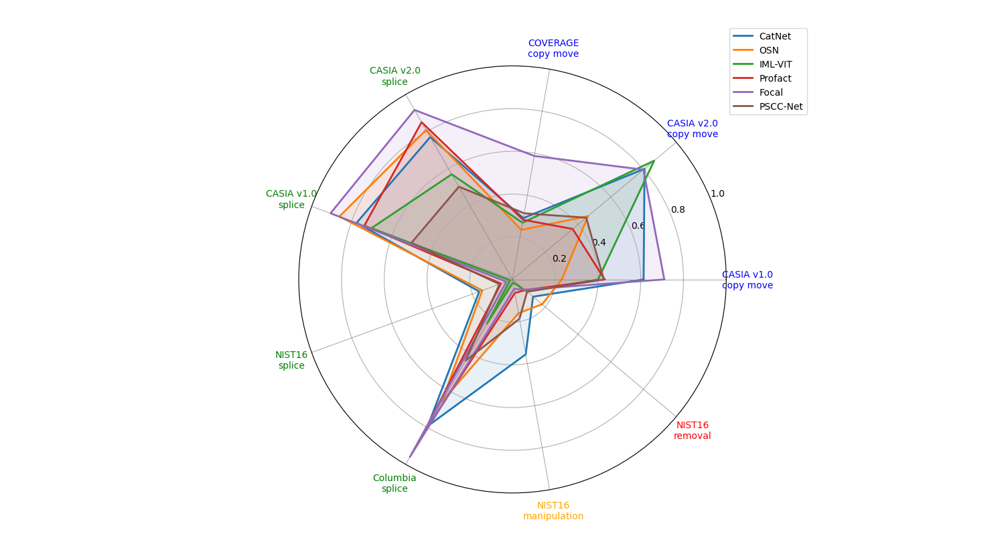
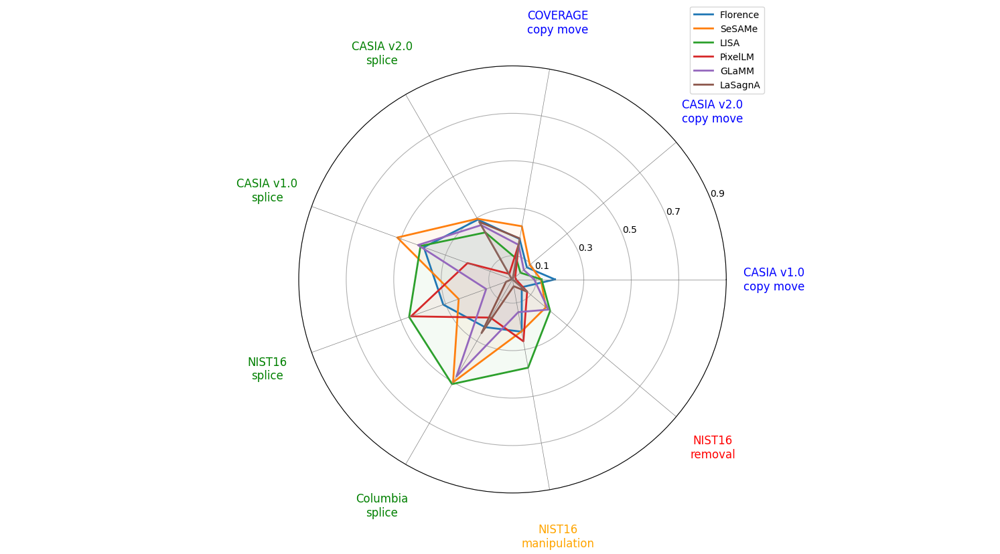

# Performance Evaluation of Multimodal Large Language Models in Image Forgery Detection

[English Version](README_EN.md) ｜ [中文版](README_CN.md)

## 📋 Project Overview

This project aims to systematically analyze and compare the performance differences between **traditional specialized tampering detection models** and **multimodal large language models (MLLMs)** in the field of image forgery detection. Through comprehensive evaluation of various tampering types and datasets, we provide scientific basis for model selection and optimization in the field of image content security.

## 🔬 Project Information
- **Supervisor**: Chen Changsheng
- **Laboratory**: Shenzhen Key Laboratory of Media Information Content Security

## 🚀 Project Features
- **First Systematic Evaluation**: First comprehensive analysis of MLLMs' performance in tampered image detection
- **Multi-dimensional Comparison**: Comprehensive comparison from multiple tampering types, different datasets, and various evaluation metrics

## 📊 Tampering Types and Datasets

### Common Tampering Types
Through research and analysis, we identified four common types of image tampering:
- **Copy Move**: Copying part of the content in an image and moving it to another location
- **Splice**: Splicing parts of different images together
- **Manipulation**: Modifying or editing image content
- **Removal**: Removing part of the content in an image

### Experimental Datasets
We used multiple common image tampering detection datasets in our experiments: CASIA v1.0, CASIA v2.0, Columbia, NIST, COVERAGE, IMD2020

## 🤖 Evaluation Models

### Traditional Tampering Detection Models
We evaluated six traditional models specifically trained or fine-tuned on the MIML training set:

| Model Name | Features |
|---------|------|
| CatNet | Deep learning-based tampering detection model |
| OSN | Model optimized for specific tampering types |
| IML-VIT | Model combining Vision Transformer |
| Profact | Model focused on fine-grained tampering detection |
| Focal | Model based on focal loss function |
| PSCC-Net | Model combining pixel-level and semantic-level features |

Model architecture of traditional tampering detection model (CatNet):

These specialized models output tampering region information in the form of pixel masks and are evaluated using mask-level metrics such as Precision, Recall, F1, and IoU.

### Multimodal Large Language Models
We selected and evaluated six representative multimodal large language models:

| Model Name | Features |
|---------|------|
| Florence-2-large | General visual-language model |
| SESAME | Multimodal model optimized for security scenarios |
| LISA-13B | Large multimodal understanding model |
| PixelLM_13B | Large language model with pixel-level understanding |
| GLaMM | General multimodal masking model |
| LaSagnA | Multimodal model for security applications |

Model architecture of multimodal large language model (LISA):

These models can output corresponding tampering masks based on input images and text descriptions. We compared and analyzed their detection capabilities on datasets of different types and sources using mask metrics such as Precision, Recall, F1, and IoU.

## 📈 Experimental Results

### Example Images
Here are some example results of models on tampering detection tasks:

- Tampered regions detected by traditional tampering detection models

- Tampered regions detected by multimodal large language models

### IOU Metrics Comparison
Radar charts intuitively show the performance comparison of different models on IOU metrics:

- Radar chart of IOU metrics for traditional tampering detection models on different tampering types

- Radar chart of IOU metrics for multimodal large language models on different tampering types
 

## 📝 Conclusions

### Performance of Traditional Tampering Detection Models
Compared with general multimodal large language models, these specialized models have been custom-trained for specific data and tasks, thus having certain advantages in detecting specific types of tampering.

### Performance of Multimodal Large Language Models
Multimodal large language models show significant differences in performance across different tampering tasks. Overall, some models perform relatively well in detecting specific types of tampering (such as in splice tasks), but still lack universal high-precision performance for all types of tampering.

### Overall Evaluation
Current existing models have shortcomings in both the breadth and depth of tampering detection: general large models have strong adaptability but need improvement in precision, while specialized models perform better in specific scenarios but have weak generalization capabilities.

## 🔍 Future Outlook
Based on the evaluation results of this project, future research can focus on the following directions:
1. Targeted fine-tuning of multimodal large language models to address their shortcomings in specific tampering types
2. Development of more comprehensive tampering detection benchmark datasets and evaluation metrics